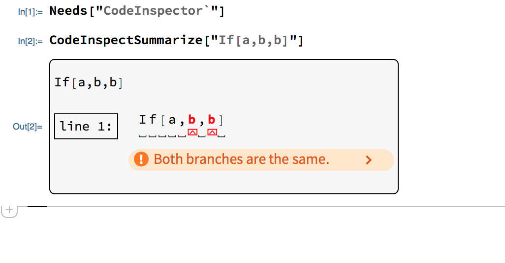
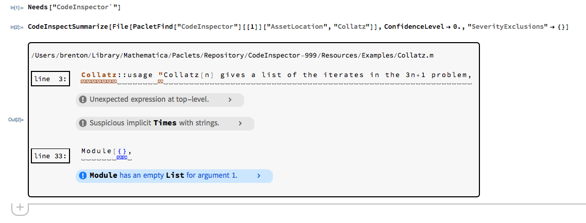

# CodeInspector

CodeInspector is a package for finding and reporting problems in Wolfram Language code.
CodeInspector has a large collection of rules that can be used to inspect Wolfram Language source code files and can be customized to your preferences. 

In a stand-alone kernel:
```
In[1]:= Needs["CodeInspector`"]

In[2]:= CodeInspectSummarize["If[a,b,b]"]

Out[2]= If[a,b,b]

        line 1:  If[a,b,b] 
                      ^ ^  
                DuplicateClauses Error Both branches are the same.
```

In a front end:


[Finding Bugs in the Wolfram Language from WTC 2019: Watch Video](https://www.wolfram.com/broadcast/video.php?v=2911)

[Finding Bugs in the Wolfram Language from WTC 2019: Download Presentation](https://files.wolframcdn.com/pub/www.wolfram.com/technology-conference/2019/Thursday/2019BrentonBostickFindingBugsInTheWL.nb)


## Setup

Install CodeInspector and dependencies from the paclet server:
```
In[1]:= PacletInstall["CodeParser"]
			PacletInstall["CodeInspector"]

Out[1]= PacletObject[CodeParser, 1.0, <>]
Out[2]= PacletObject[CodeInspector, 1.0, <>]
```

CodeInspector depends on the CodeParser paclet. Make sure that the paclets can be found on your system:
```
In[1]:= Needs["CodeInspector`"]
```


## Using CodeInspector

After CodeParser and CodeInspector are installed, CodeInspector can be used.

Return the list of all problems found in a string of code:
```
In[1]:= Needs["CodeInspector`"]

In[2]:= CodeInspect["If[a,b,b]"]

Out[2]= {DuplicateClauses Error Both branches are the same.}
```

Summarize the problems found in a source code file:


